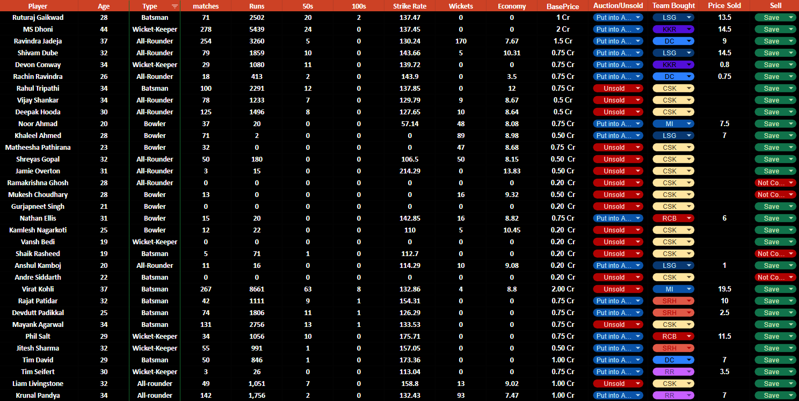
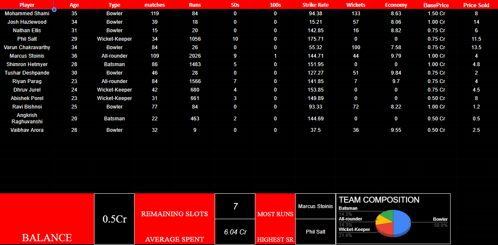
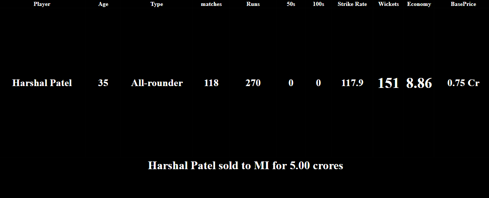

# Cricket-Auction-Simulation-and-Stats-in-Excel

# IPL Auction Simulator

An interactive IPL auction simulation system built with **Google Sheets and Google Apps Script**, combining player data, auction controls, automated team management, budget tracking, and squad analytics.

## Interactive Simulator

**[Open the IPL Auction Simulator](https://docs.google.com/spreadsheets/d/1BTkf_W11GXOFUUhCd580geEe8XNG90ZizknfG72oSNc/edit?usp=drive_link)**

## Features

* Interactive auction management using dropdown-based controls
* Automated player status and team assignment
* Real-time purse and squad-slot tracking
* Dedicated sheets for each team
* Player performance statistics and auction prices
* Team composition and squad analysis
* Dynamic dashboards with key team metrics
* Custom Google Apps Script for auction automation

## Technical Implementation

* **Google Sheets** — Data management, calculations, dashboards, and visualization
* **Google Apps Script** — Auction logic and spreadsheet automation
* **Data Validation** — Interactive controls and team assignments
* **Spreadsheet Formulas** — Cross-sheet calculations and real-time updates

## Auction Workflow

```text
Player Pool → Auction Controls → Sold/Unsold
                     |
                     v
              Team Assignment
                     |
                     v
          Budget & Squad Updates
                     |
                     v
             Team Analytics
```

## Screenshots

### Auction Interface



### Team Dashboard



### Manager Controls




## Author

**Vikram Balaji Subrahmanyam**
MS Data Analytics for Science, Carnegie Mellon University
